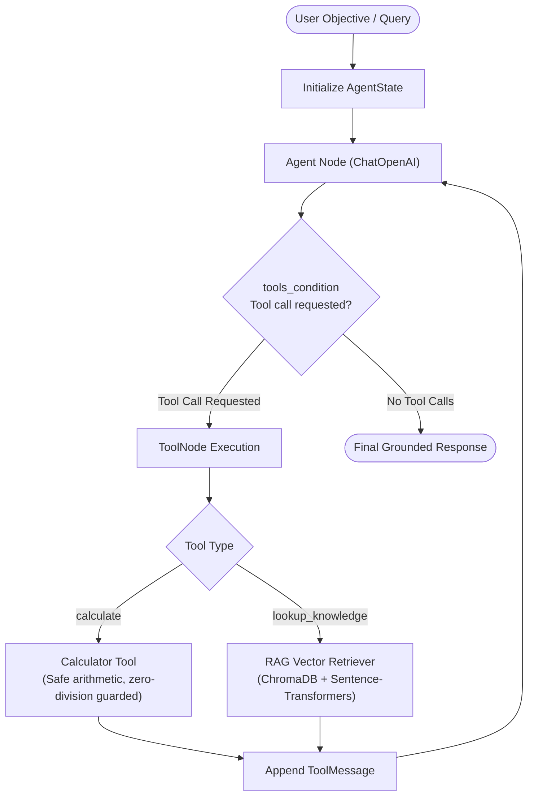
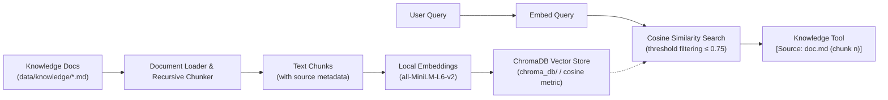

# AgentOps AI

> Autonomous AI Business Intelligence & Research Agent powered by LangGraph, LangChain, and ChromaDB.

AgentOps AI is an enterprise-grade agentic workflow designed to transform high-level business objectives into grounded, verifiable, and structured intelligence reports. It integrates cyclical planning, autonomous tool calling, arithmetic reasoning, and a local Retrieval-Augmented Generation (RAG) subsystem to eliminate hallucinations and enforce strict source attribution.

---

## Architecture Overview

AgentOps AI is constructed around an event-driven, cyclical state machine orchestrated by **LangGraph**, backed by **OpenAI models**, and augmented with **local vector retrieval** and **deterministic tooling**.



---

## Production RAG Subsystem

The Retrieval-Augmented Generation (RAG) subsystem ensures enterprise knowledge is indexed locally and retrieved with mathematical precision.



### How RAG Works in AgentOps AI
1. **Document Loading**: Ingests Markdown and text documents from `data/knowledge/` preserving file lineage.
2. **Recursive Text Chunking**: Splits documents along section and paragraph boundaries (`chunk_size=500`, `chunk_overlap=50`) while retaining source file names, chunk indices, and unique identifiers.
3. **Local Dense Embeddings**: Generates 384-dimensional dense vectors using `sentence-transformers` (`all-MiniLM-L6-v2`) locally on-device. No internal documentation is transmitted to third-party embedding APIs.
4. **ChromaDB Indexing**: Persists embeddings and chunk metadata to `chroma_db/` using cosine similarity (`hnsw:space: cosine`). Ingestion uses `upsert` with deterministic IDs (`doc_chunk_idx`) to guarantee idempotency.
5. **Distance Threshold Filtering**: Retrieves top-$k$ relevant chunks and discards matches with a cosine distance $> 0.75$, returning `"No relevant information found"` for out-of-domain queries rather than injecting misleading noise.
6. **Source Attribution**: Injects retrieved excerpts with explicit `[Source: filename.md (chunk N)]` headers into the tool message stream for transparent LLM reasoning.

---

## Project Structure

```text
AgentOps-AI/
├── app/
│   ├── agents/
│   │   ├── __init__.py        # Agent module exports
│   │   └── graph.py           # LangGraph StateGraph agent with cyclical tool-calling
│   ├── rag/
│   │   ├── __init__.py        # RAG module exports
│   │   ├── document_loader.py # Document parser and recursive text chunker
│   │   ├── ingest.py          # Knowledge base ingestion CLI & pipeline
│   │   └── retriever.py       # ChromaDB vector retriever and context formatter
│   ├── tools/
│   │   ├── __init__.py        # Tool module exports
│   │   ├── calculator.py      # LangChain arithmetic tool (+, -, *, /)
│   │   └── knowledge.py       # LangChain RAG knowledge retrieval tool
│   └── main.py                # Command-line entry point for running the agent
├── data/
│   └── knowledge/             # Sample Markdown knowledge base documents
│       ├── architecture.md    # System architecture and technical stack
│       ├── pricing.md         # Subscription tiers and feature matrix
│       ├── project_overview.md# Vision, capabilities, and target audience
│       └── security.md        # Governance, privacy, and secret management
├── tests/
│   ├── __init__.py
│   ├── test_agent.py          # Agent graph construction and cyclical tool-calling tests
│   ├── test_rag.py            # Document loading, chunking, embedding, and indexing tests
│   └── test_tools.py          # Calculator arithmetic and RAG retrieval tests
├── .env.example               # Safe environment variable configuration template
├── requirements.txt           # Direct project dependencies
└── README.md                  # Project documentation
```

---

## Installation & Setup

### 1. Prerequisites
- Python 3.12+
- Virtual environment (`.venv`)

### 2. Activate Virtual Environment & Install Dependencies
```bash
# Activate your existing Python 3.12 virtual environment
source .venv/bin/activate

# Install required direct dependencies
pip install -r requirements.txt
```

### 3. Configure Environment Variables
Copy the template configuration file:
```bash
cp .env.example .env
```
Edit `.env` to configure your settings:
```env
# OpenAI API configuration (required for live LLM execution)
OPENAI_API_KEY=your_openai_api_key_here
OPENAI_MODEL=gpt-4o-mini

# Local RAG & Vector Database Configuration
CHROMA_PERSIST_DIRECTORY=chroma_db
EMBEDDING_MODEL=all-MiniLM-L6-v2
```

---

## Knowledge Base Ingestion

Before querying the agent about internal knowledge, index the documents into ChromaDB:

```bash
.venv/bin/python -m app.rag.ingest
```

**Ingestion Output:**
```text
============================================================
AgentOps AI - Knowledge Base Ingestion Pipeline
============================================================
[RAG Ingestion] Scanning knowledge directory: data/knowledge
[RAG Ingestion] Found 4 document(s). Processing chunks...
  - architecture.md: 1826 chars -> 5 chunk(s)
  - pricing.md: 1412 chars -> 4 chunk(s)
  - project_overview.md: 1505 chars -> 3 chunk(s)
  - security.md: 1528 chars -> 5 chunk(s)
[RAG Ingestion] Upserting 17 chunk(s) into collection 'agentops_knowledge'...
[RAG Ingestion] Ingestion complete. Total indexed chunks in collection: 17
Successfully processed and indexed 17 chunk(s).
```

---

## Running the Agent

### Command-Line Execution
Run the agent with a direct prompt:
```bash
.venv/bin/python -m app.main "How much does the Starter plan cost per year, and what would 3 months cost?"
```

### Interactive Mode
Run without arguments to launch the interactive prompt:
```bash
.venv/bin/python -m app.main
```

---

## Example Questions & Expected Behavior

| Prompt Category | Example Question | Agent Execution Behavior |
| :--- | :--- | :--- |
| **RAG Knowledge Retrieval** | *"What subscription tiers does AgentOps AI offer?"* | Calls `lookup_knowledge`, retrieves excerpts from `pricing.md`, cites Starter ($49/mo), Professional ($199/mo), and Enterprise tiers. |
| **Deterministic Arithmetic** | *"What is 1542 divided by 6?"* | Calls `calculate(a=1542, b=6, operation='divide')` and returns `257` without hallucination. |
| **Multi-Tool Synthesis** | *"What is the annual cost of the Professional plan if we get a 10% discount?"* | Calls `lookup_knowledge` to find the Professional plan price ($1,990/year), then calls `calculate` to compute `1990 * 0.9 = 1791`. |
| **Out-of-Domain Query** | *"What is the capital of Mars?"* | Calls `lookup_knowledge`, distance threshold rejects irrelevant documents, agent gracefully states no verified information is available. |

---

## Testing

The test suite validates document loading, text chunking, embedding generation, ChromaDB vector indexing, distance thresholding, arithmetic operations, and cyclical LangGraph tool-calling **without making external LLM API calls**.

Run the full automated test suite:
```bash
.venv/bin/python -m unittest discover -s tests -v
```

**Test Suite Coverage:**
- `tests/test_rag.py`: Document loading, chunking boundaries, metadata preservation, local embedding vector dimensions, ChromaDB indexing in isolated temporary directories, and similarity retrieval.
- `tests/test_tools.py`: Calculator operations (+, -, *, /), division-by-zero protection, invalid operation handling, and RAG knowledge retrieval.
- `tests/test_agent.py`: LangGraph StateGraph compilation, node presence, error handling when credentials are missing, and multi-turn cyclical agent tool execution with mocked LLMs.

---

## Security & Secrets Policy

1. **Zero Hardcoded Secrets**: Secrets and API keys are strictly forbidden in source code and vector stores.
2. **Environment Isolation**: `.env` and `chroma_db/` are explicitly listed in `.gitignore` and are never committed to version control.
3. **Local Privacy First**: Embeddings are computed locally using open-source sentence-transformer models. Proprietary knowledge documents never leave your infrastructure for vectorization.